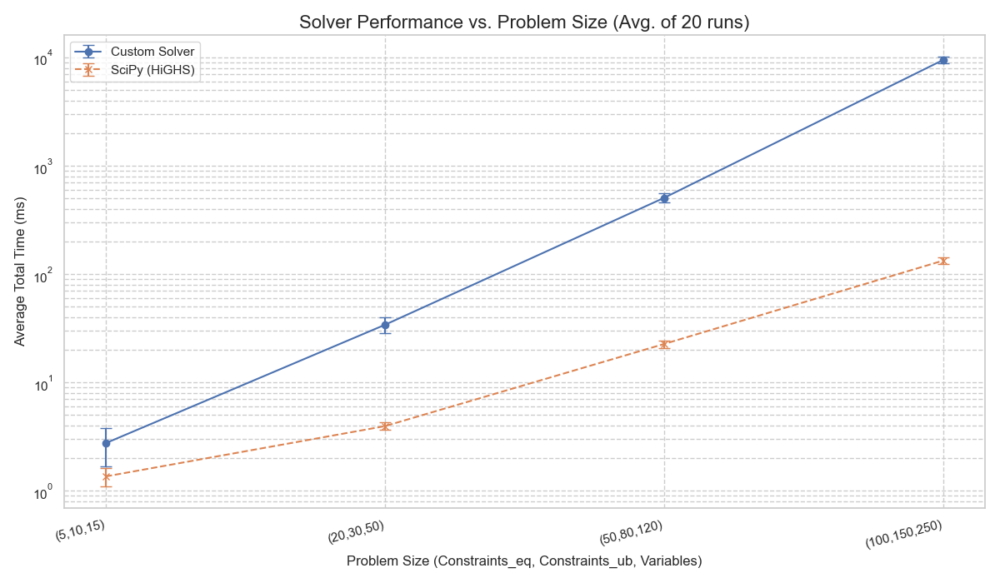
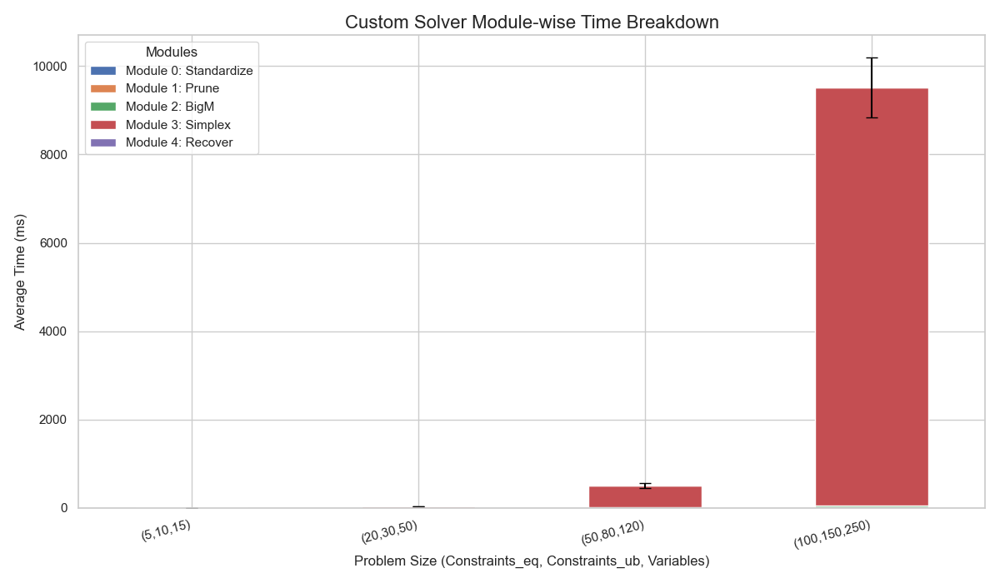

# 实验1：使用单纯形法求解线性规划问题

## 问题描述

使用单纯形法求解线性规划问题
$$
\begin{align}
\min &\quad c^\top x \\
\text{s.t.} &\quad A_{eq} x = b_{eq} \\
&\quad A_{ub} x \leq b_{ub} \\
&\quad x \in \text{bounds}
\end{align}
$$

## 算法原理

单纯形法是解决线性规划问题的一种高效算法。其基本思想是在可行域的顶点（基本可行解）之间进行迭代移动，逐步优化目标函数，直至找到最优解或证明问题无界。

本实现采用**标准单纯形表法**，该方法将整个线性规划问题的所有信息（目标函数系数、约束矩阵、右端项）都整合在一个称为**单纯形表 (Simplex Tableau)** 的矩阵中。所有的迭代和决策都通过对这个表进行规范的行操作来完成。

### 具体步骤

1. **初始化**
   首先，将线性规划问题转化为标准型，并构建初始的单纯形表。通常，松弛变量可以直接作为初始基变量。若缺少初始基，则通过**大M法**引入人工变量来构造一个初始的基本可行解对应的单纯形表。

2. **最优判定**
   对于最大化问题，如果这一行中所有对应非基变量的系数均小于或等于零，则说明当前的基本可行解已经是最优解，算法终止。

3. **转轴运算**
   如果当前解不是最优解，则需进行一次转轴（Pivot）操作来移动到更优的相邻顶点。转轴操作分为三步：

   - **选择入基变量**：在目标函数行中，选择一个**正系数**对应的非基变量作为入基变量。选择哪个正系数决定了不同的主元规则。例如，**Dantzig规则**选择值最大的系数，而**Bland规则**选择下标最小的变量，后者能有效避免循环。

   - **选择出基变量**：对入基变量所在列的**所有正元素**，计算其所在行右端项（RHS）与该元素的比值。选择**最小比值**对应行中的基变量作为出基变量。
   - **更新单纯形表**：以入基变量的列和出基变量的行交叉处的元素为主元，执行**高斯-若尔当消元**操作，目标是使主元变为1，主元所在列的其他所有元素都变为0。

4. **终止条件**： 算法在以下两种情况之一发生时终止：

   - **找到最优解**：如步骤2所述，目标函数行所有系数均非正。
   - **问题无界**：在步骤3中选择了入基变量后，发现其所在列的所有元素均小于或等于零，无法进行最小比值检验。这表明目标函数值可以无限增大，问题无界。

5. **退化处理**： 当一个或多个基变量的值为零时，称为退化。退化可能导致算法在多个基本可行解之间循环，无法收敛。本实现采用的**Bland规则**是一种理论上能保证在有限步内跳出循环、确保算法收敛的有效策略。

## 代码实现

单纯形法的代码实现可以分为以下五个模块，每个模块负责解决问题中的一个特定部分。

### 模块0：转化为标准形

首先，我们需要将原始线性规划问题转化为标准型形式，确保目标函数为最大化形式，约束为等式约束：
$$
\begin{align}
\max &\quad c^\top x \\
\text{s.t.} &\quad A x = b \\
&\quad x \geq 0
\end{align}
$$
主要步骤：

- **固定变量处理**：如果某些变量的上下界相等（例如 xj=0x_j = 0xj=0），直接将这些变量从问题中删除，裁剪掉对应的行和列。
- **变量平移**：对于有下界约束的变量 $x_j \geq \text{lb}_j$，我们执行平移 $y_j = x_j - \text{lb}_j$，将变量转为非负形式。这样我们可以将所有变量统一为 $y_j \geq 0$。
- **无下界变量拆分**：对于没有下界约束的变量（例如 $x_j \geq -\infty$），将其拆分为两个非负变量 $x_j = u_j - v_j$，其中 $u_j, v_j \geq 0$。
- **不等式转化为等式**：将所有 $\leq$ 约束转化为等式约束，方法是为每个不等式约束添加松弛变量 $s_j$，使得约束变为 $A_{ub}x + s = b$，其中 $s \geq 0$。
- **目标函数转化**：如果原始问题是最小化问题，将目标函数取负转化为最大化形式。

**核心代码 (`module0_standardize.py`)**

```python
def to_standard_form(
    lp: LPProblem,
    tol: float = DEFAULT_TOLERANCE
) -> Tuple[LPStandardForm, StandardFormTransform]:
    """
    将最小化形式的 LP 转为“最大化”标准形：
      max c_std^T x_std  s.t. A_std x_std = b_std,  x_std >= 0
    返回：(LPStandardForm, StandardFormTransform)
    """
    # ---- 基本输入检查与拷贝 ----
    # ... (详细的输入校验和数据拷贝/初始化代码省略) ...
    c = np.asarray(lp.c, dtype=float).copy()
    n = c.size
    Aeq = ...
    beq = ...
    Aub = ...
    bub = ...
    lb, ub = _normalize_bounds(lp.bounds, n)

    # === 第 0 步：处理固定变量 lb==ub ===
    z0 = 0.0
    keep_cols = []           # 非固定的原列索引
    fixed_values = [None]*n  # 记录固定值
    for j in range(n):
        if np.isfinite(lb[j]) and np.isfinite(ub[j]) and abs(lb[j]-ub[j]) <= tol:
            v = lb[j]
            fixed_values[j] = v
            z0 += c[j]*v
            if Aeq.shape[0] > 0:
                beq = beq - Aeq[:, j]*v
            if Aub.shape[0] > 0:
                bub = bub - Aub[:, j]*v
        else:
            keep_cols.append(j)

    # 如果有固定列，裁剪 A、c、lb、ub
    if len(keep_cols) < n:
        Aeq = Aeq[:, keep_cols] if Aeq.size else Aeq
        Aub = Aub[:, keep_cols] if Aub.size else Aub
        c   = c[keep_cols]
        lb  = lb[keep_cols]
        ub  = ub[keep_cols]
        n   = len(keep_cols)

    # === 第 1 步：为剩余变量做平移/拆分 ===
    # ... (初始化 var_names, c_trans, Aeq_cols, Aub_cols 等列表) ...
    for j in range(n):
        col_eq = Aeq[:, j] if Aeq.size else np.zeros(0)
        col_ub = Aub[:, j] if Aub.size else np.zeros(0)
        cj     = c[j]

        if np.isfinite(lb[j]):
            # 平移：x = y + lb_j，y>=0
            # ... (添加平移变量, 更新 c_trans, Aeq_cols, Aub_cols) ...
            # ... (处理上界约束, 更新 cap_rows, cap_rhs) ...
            z0 += cj * lb[j]
        else:
            # lb = -inf → 拆分: x = y+ - y-
            # ... (添加拆分变量, 更新 c_trans, Aeq_cols, Aub_cols) ...
            # ... (处理上界约束, 更新 cap_rows, cap_rhs) ...
    
    # ... (组装 A_eq, A_ub 的列, 并将上界约束追加到 Aub_new) ...

    # === 第 2 步：把所有 ≤ 约束统一为等式，添加松弛变量 S >= 0 ===
    m_eq = Aeq_new.shape[0]
    m_ub = Aub_new.shape[0]
    if m_ub > 0:
        S = np.eye(m_ub)
        A_top = np.hstack([Aeq_new, np.zeros((m_eq, m_ub))]) if m_eq>0 else np.zeros((0, N_y+m_ub))
        A_bot = np.hstack([Aub_new, S])
        A_std = np.vstack([A_top, A_bot]) if m_eq>0 else A_bot
        b_std = np.concatenate([np.asarray(beq, dtype=float), np.asarray(bub, dtype=float)]) if m_eq > 0 else np.asarray(bub, dtype=float)
        c_std_min = np.concatenate([np.array(c_trans, dtype=float), np.zeros(m_ub)])
        # ...
    else:
        A_std = Aeq_new
        b_std = beq
        c_std_min = np.array(c_trans, dtype=float)
        # ...
    
    # ... (终检 finite) ...

    # === 第 3 步：min → max（标准形以最大化为准）===
    c_std = -c_std_min
    std = LPStandardForm(A=A_std, b=b_std, c=c_std, ...)

    # === 映射信息（对应原始 n_total 变量，下标以原顺序计）===
    # ... (构建并返回 StandardFormTransform 对象) ...
    return std, xfm
```

### 模块1：秩检查与冗余约束移除

在此模块中，我们对约束矩阵进行秩检查，并移除冗余约束。

- **秩检查**：采用带列主元的QR分解（RRQR）来估计矩阵的有效秩。
- **冗余约束移除**：识别线性相关的行，并在确保右端项一致性的前提下将其移除，最终得到一个行满秩的约束系统。

**核心代码 (`module1_redundancy.py`)**

```python
def prune_redundant_rows_rrqr(std: LPStandardForm, tol: float) -> LPStandardForm:
    A = np.asarray(std.A, dtype=float)
    b = np.asarray(std.b, dtype=float).reshape(-1)
    _ensure_inputs(A, b, tol)

    m, n = A.shape
    if m == 0:
        return std  # 空系统

    # 0) 全零行处理
    nonzero_rows: List[int] = []
    for i in range(m):
        if np.max(np.abs(A[i, :])) <= tol:
            if abs(b[i]) > tol:
                raise InfeasibleError("不可行：出现零行但 b 非零", ...)
        else:
            nonzero_rows.append(i)

    if not nonzero_rows:
        # ... (返回空系统) ...
    
    A0 = A[nonzero_rows, :]

    # 1) RRQR（对 A0^T）
    try:
        Q, R, piv = qr(A0.T, mode="economic", pivoting=True)
    except Exception as e:
        raise NumericIssueError("QR 分解失败（pivoting=True）", ...)

    diag = np.abs(np.diag(R))
    if diag.size == 0:
        r = 0
    else:
        thresh = tol * max(A0.shape) * (diag[0] if diag[0] > 0 else 1.0)
        r = int(np.sum(diag > thresh))

    keep_local = np.sort(piv[:r]) if r > 0 else np.array([], dtype=int)
    keep_rows = [nonzero_rows[i] for i in keep_local]

    # 2) 一致性检查（对相关行）
    dependent_rows = [i for i in nonzero_rows if i not in keep_rows]
    # ... (处理极端病态情况) ...

    A_keep = A[keep_rows, :]
    b_keep = b[keep_rows]

    for i in dependent_rows:
        row = A[i, :]
        row_resid, b_hat = _rowspace_fit(row, A_keep, b_keep, tol)
        # ... (根据残差和b的差异，决定保守纳入或判定不可行) ...
        if abs(b[i] - b_hat) > (10 * tol * (1.0 + abs(b[i]))):
            raise InfeasibleError("不可行：线性相关行对 RHS 不一致", ...)

    # 3) 输出
    keep_rows = sorted(set(keep_rows))
    A2 = A[keep_rows, :]
    b2 = b[keep_rows]
    hints = _rebuild_slack_hints(A2, tol)

    return LPStandardForm(A=A2, b=b2, c=std.c.copy(),
                          var_names=list(std.var_names),
                          base_indices_hint=hints)
```

### 模块2：使用大M法构造初始基

使用大M法，为任意标准型问题构造一个初始基本可行解，从而启动单纯形法的迭代过程。

- **引入人工变量**：为那些没有现成单位列的约束行，引入**人工变量**。
- **构造初始单纯形表**：在目标函数中对人工变量施加一个极大的惩罚系数 M，然后计算初始的约化成本行和目标函数值 z，最终组装成一个完整的单纯形表对象。

**核心代码 (`module2_bigm.py`)**

```python
def init_with_big_m(
    std: LPStandardForm,
    tol: float,
    M: float | None = None,
) -> Tableau:
    """
    用大 M 法构造初始可行基解的单纯形表。
    """
    # -------- 基础输入检查 --------
    # ... (详细的输入校验代码省略) ...
    A = np.asarray(std.A, dtype=float).copy()
    b = np.asarray(std.b, dtype=float).reshape(-1).copy()
    c = np.asarray(std.c, dtype=float).reshape(-1).copy()
    m, n = A.shape

    if M is None:
        M = _auto_big_m(c)
    # ...

    # --- 第0步：确保 b >= 0（行翻转） ---
    for i in range(m):
        if b[i] < -tol:
            A[i, :] *= -1.0
            b[i]    *= -1.0
    # ...

    # --- 第1步：优先使用现有单位列；不足的用人工列补齐 ---
    basis: List[int] = [-1] * m
    # ... (扫描 hint 和所有列，寻找已有单位列填充 basis 的逻辑省略) ...

    # --- 第2步：添加人工列 ---
    if not np.all(use_existing):
        need_rows = [i for i in range(m) if not use_existing[i]]
        k = len(need_rows)
        A_ext = np.hstack([A, np.zeros((m, k), dtype=float)]) if n > 0 else np.zeros((m, k), float)
        c_ext = np.concatenate([c, -M * np.ones(k, dtype=float)])

        for t, irow in enumerate(need_rows):
            col_idx = n + t
            A_ext[irow, col_idx] = 1.0
            basis[irow] = col_idx
        
        A, c, n = A_ext, c_ext, A_ext.shape[1]

    if any(jb == -1 for jb in basis):
        raise PresolveError("无法构造初始可行基", ...)

    # --- 第3步：构造初始目标行（约化成本）与 z ---
    obj_row = c.copy()
    z = 0.0
    for i in range(m):
        j_b = basis[i]
        c_B = c[j_b]
        if abs(c_B) > tol:
            obj_row -= c_B * A[i, :]
            z += c_B * b[i]

    # --- 第4步：构造 nonbasis 并返回表 ---
    nonbasis = [j for j in range(n) if j not in basis]
    # ... (最终数值体检省略) ...
    
    return Tableau(A=A, b=b, c=obj_row, z=float(z), basis=basis, nonbasis=nonbasis, iteration=0)
```

### 模块3：单纯形法迭代

此模块是算法的核心，通过一系列的转轴操作，逐步逼近最优解。

- **最优性检验**：检查约化成本行 c 是否所有元素均非正。
- **入基/出基变量选择**：若未达到最优，根据特定规则（如Bland规则）选择**入基变量**，再通过**最小比值检验**确定**出基变量**。
- **转轴操作**：以主元为中心，执行高斯-若尔当消元，更新整个单纯形表。

**核心代码 (`module3_simplex.py`)**

```python
def iterate_simplex(
    tab: Tableau,
    max_iter: int = 10000,
    rule: PivotRule = "bland",
    dual_tol: float = 1e-9,
    pivot_tol: float = 1e-12,
) -> LPSolution:
    """
    单纯形法（标准形最大化）。
    """
    # ... (输入检查和Tableau复制) ...
    T = tab.copy()
    _ensure_tableau(T, dual_tol, pivot_tol)

    # ... (初始可行性检查) ...

    it = 0
    while it < max_iter:
        T.iteration = it

        # 1) 选入基列
        j_enter = _choose_entering_max(T.c, rule, dual_tol)
        if j_enter is None:
            # 最优
            x = _current_x(T)
            return LPSolution(True, "optimal", float(T.z), x, it)

        # 2) 选离基行（最小比值检验）
        i_leave = _choose_leaving(T.A[:, j_enter], T.b, pivot_tol, rule)
        if i_leave is None:
            # 无界
            raise UnboundedError("线性规划无界（进入列在约束中无正元素）", ...)

        # 3) 枢轴
        _pivot_inplace(T, i_leave, j_enter, tol_clip=max(1e-14, pivot_tol*1e-2))

        it += 1

    # 迭代上限
    raise IterationLimitExceeded("达到迭代上限", ...)
```

### 模块4：标准型恢复到原问题

单纯形法结束后，得到的是标准型下的最优解。此时，我们需要将解转换回原问题的变量空间。

- **恢复决策变量**：利用模块0保存的转换信息，通过逆向操作（合并、反向平移等），从 $x_{std}$计算出原始变量 x 的最优值。
- **恢复目标函数**：根据记录的转换信息，将标准型的最优目标值 $z_{std}$ 恢复为原问题的最优目标值。

具体实现略

## 测试程序说明

为评估求解器性能，我们编写了`benchmark_plot.py`测试程序。该程序的核心功能如下：

1. **生成可行的测试问题**：自动生成不同规模（约束和变量数量）且保证有可行解的随机线性规划问题。
2. **重复测试与对比**：对每个预设规模，重复运行20次，并使用`scipy.optimize.linprog`作为基准进行对比。
3. **数据采集与聚合**：程序会分模块记录自定义求解器的耗时，并对20次成功运行的结果取平均值，以获得稳健的性能数据。
4. **结果可视化**：测试结束后，自动生成性能摘要表和两张对比图表（总耗时对比图、模块耗时分解图），用于直观分析。

## 运行结果

### 性能数据

下表汇总了自定义求解器与SciPy在不同问题规模下的平均性能数据。

```
============================== Benchmark Summary ==============================
         Size Custom Time (ms) SciPy Time (ms) Custom Success Rate SciPy Success Rate
    (5,10,15)      2.76 ± 1.06     1.36 ± 0.26                 70%                70%
   (20,30,50)     34.12 ± 5.70     3.96 ± 0.31                100%               100%
  (50,80,120)   506.85 ± 48.65    22.69 ± 1.73                100%               100%
(100,150,250) 9511.19 ± 676.02   133.66 ± 8.74                 75%               100%
```

### 性能图表

**图1：求解器总耗时对比**



**图2：自定义求解器模块耗时分解**



## 分析总结

本次实验从理论出发，通过模块化的编程实践，成功地从零开始构建了一个功能完备的单纯形法求解器。为了全面评估其表现，我们设计并执行了一系列系统的性能测试。综合整个实验过程，核心的分析与总结如下：

1. **基本功能正确，但数值稳定性不足**： 在求解成功的情况下，本求解器的计算结果与SciPy一致，验证了算法逻辑的正确性。然而，在最大规模的测试中，成功率下降至75%（而SciPy为100%），这暴露了当前实现在处理复杂问题时存在数值稳定性问题，容易因浮点误差累积而失败。
2. **性能瓶颈明确**： 模块耗时数据显示，**`模块3：单纯形迭代`** 是绝对的性能瓶颈。在最大规模问题上，该模块的耗时占总时长的**99%**以上，其计算效率直接决定了整个求解器的性能上限。
3. **与工业级求解器的效率差距显著**： 本求解器与SciPy的性能差距随问题规模增大而指数级扩大。这主要是由于算法上的根本差异：本实现采用的**标准单纯形表法**在计算上远不及SciPy所使用的**修正单纯形法**等高级优化算法高效。
