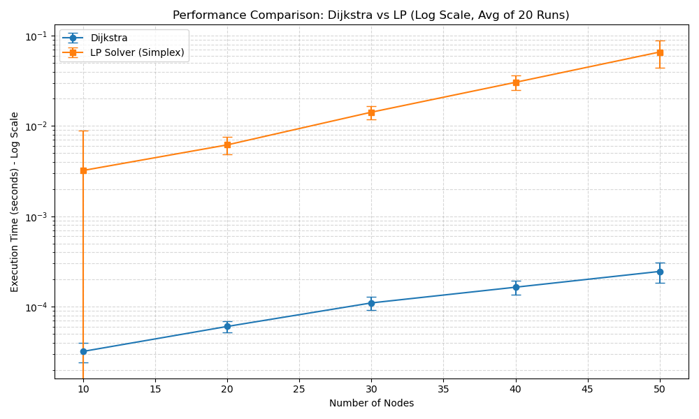

# 实验2：最短路问题（Dijkstra 与 LP 建模）

赵文凯 PB23000209

## 问题描述

给定带权有向图 $G=(V,E)$，边权 $c_{ij}\ge 0$。给定源点 $s$ 与汇点 $t$，求从 $s$ 到 $t$ 的最短路长度：

$$
\min_{P:s\to t} \sum_{(i,j)\in P} c_{ij}
$$

本实验实现两种求解方式并比较运行时间：

1. Dijkstra
2. 线性规划建模（最小费用流）+ 实验 1 的 `lp_solver`

## 算法原理

### 1) 随机数据生成（Erdős–Rényi 强连通有向图）

为了进行性能对比，需要生成大量随机测试图。代码使用 NetworkX 生成 $G(n,p)$ 型随机**有向图**，并循环采样直到满足**强连通**：

```python
G = nx.erdos_renyi_graph(n, p, directed=True)
nx.is_strongly_connected(G)

```

随机图连通性阈值参考：
$$
p > \frac{(1+\epsilon)\ln n}{n}
$$
实现中取 $\epsilon=0.5$，并使用
$$
p = \max\left(\frac{(1+\epsilon)\ln n}{n},\ 0.2\right)
$$
以避免边过稀导致反复采样。

当生成的图满足强连通后，为每条边赋权重 `weight in {1,...,10}`（正整数）。

### 2) Dijkstra（heapq 堆优化）

Dijkstra 适用于非负边权图。算法维护从源点到各点的当前最短距离估计，并反复取出距离最小的未确定节点进行松弛。

实现要点如下：

- 使用 `heapq` 实现最小堆（符合“不直接使用 PriorityQueue”要求）
- 运行前检查是否存在负权边（存在则报错）
- 当弹出节点为目标点 `target` 时提前返回最短路长度

使用二叉堆的时间复杂度为：
$$
O\big((|E|+|V|)\log|V|\big)
$$

### 3) 线性规划建模：最短路 = 最小费用流

最短路可表示为“从 $s$ 向 $t$ 发送 1 单位流的最小费用流”。对每条边 $(i,j)\in E$ 定义变量 $x_{ij}\ge 0$。

目标函数：
$$
\min\ \sum_{(i,j)\in E} c_{ij}x_{ij}
$$

流量守恒（每个节点一条约束）：
$$
\sum_{j:(i,j)\in E} x_{ij} - \sum_{k:(k,i)\in E} x_{ki} = b_i
$$
其中 $b_s=1$，$b_t=-1$，其余节点 $b_i=0$。

在实现中：

- 变量按边列表 `edges = list(G.edges())` 排序，$c$ 取对应 `weight`
- 构建 $A_{eq}\in\mathbb{R}^{|V|\times |E|}$：若第 $j$ 条边为 $(u,v)$，则 $A_{eq}[u,j]=+1$，$A_{eq}[v,j]=-1$
- 构建 $b_{eq}$：`b_eq[source]=1`，`b_eq[target]=-1`

由于本实验在调用 `lp_solver` 时采用不等式接口（将等式守恒约束转换后并入 $A_{ub}x\le b_{ub}$），代码将等式约束转换为两组不等式：
$$
A_{eq}x=b_{eq}\ \Longleftrightarrow\ \begin{cases}
A_{eq}x\le b_{eq}\\
-A_{eq}x\le -b_{eq}
\end{cases}
$$
即 $A_{ub}=\begin{bmatrix}A_{eq}\\-A_{eq}\end{bmatrix}$，$b_{ub}=\begin{bmatrix}b_{eq}\\-b_{eq}\end{bmatrix}$。

最后设置 `bounds=(0.0, None)` 保证 $x\ge 0$，调用 `solver.solve`，其返回的目标函数值可作为最短路长度。

## 代码实现

本实验的实现集中在 `lab2.py`，按功能可分为：

- `generate_connected_graph(n)`：生成强连通随机有向图并赋正权重
- `dijkstra_shortest_path(G, source, target)`：堆优化 Dijkstra，返回最短路长度
- `solve_shortest_path_with_my_lp(G, source, target)`：构造 LP 并调用 `lp_solver` 返回目标函数值
- `run_experiment()`：循环不同规模/多次重复实验，统计均值与标准差，并绘制/保存 `performance_comparison.png`

## 实验结果与分析

### 实验环境与设置

- 语言与环境：Python 3.10（conda 环境 `or25`）
- 图生成：NetworkX
- 计时：`time.perf_counter()`
- LP 求解器：实验 1 的自研单纯形求解器 `lp_solver`

脚本默认参数（见 `run_experiment()`）：

- `SEED = 42`
- `NODE_COUNTS = [10, 20, 30, 40, 50]`
- `NUM_TRIALS = 20`
- `source = 0`, `target = n-1`

运行后会在当前目录生成性能对比图 `performance_comparison.png`（y 轴为对数刻度，带误差棒）。

### 性能对比数据

| 节点数量 (N) | Trials | Dijkstra 时间 (Mean ± Std) | LP Solver 时间 (Mean ± Std) |
| :---: | :---: | :--- | :--- |
| 10 | 20 | 0.000032 ± 0.000008 s | 0.003221 ± 0.005699 s |
| 20 | 20 | 0.000060 ± 0.000008 s | 0.006182 ± 0.001337 s |
| 30 | 20 | 0.000110 ± 0.000019 s | 0.014227 ± 0.002305 s |
| 40 | 20 | 0.000164 ± 0.000028 s | 0.030457 ± 0.005543 s |
| 50 | 20 | 0.000246 ± 0.000063 s | 0.065890 ± 0.021947 s |

### 性能对比图



### 结果分析

根据实验数据与生成的折线图，可以进行如下分析：

1.  **Dijkstra 的绝对效率优势**：
    *   在本次测试规模下，Dijkstra 算法的平均耗时约为 $10^{-4}$ 秒量级（约 3e-5 到 2.5e-4 秒）。
    *   随着节点数增加，Dijkstra 的耗时增长较缓，且方差相对较小。结合其复杂度 $O\big((|E|+|V|)\log|V|\big)$，在本实验的随机稀疏图设置下表现稳定。

2.  **LP Solver 的复杂度与波动**：
    *   **增长趋势**：LP 求解器耗时随 $N$ 增加上升明显（N=10 的 0.003221s 到 N=50 的 0.065890s，约 20 倍）。原因是 LP 约束矩阵规模随节点数增长（约 $2N$ 行、$|E|$ 列），单纯形迭代中的枢轴更新与数值运算量随之增加。
    *   **随机性波动**：标准差相对更大，说明不同随机图实例会带来不同的 LP 结构（例如退化程度、迭代次数等），从而使运行时间波动更明显。

3.  **数量级差异**：
    在 $N=50$ 时，Dijkstra (0.000246s) 比 LP Solver (0.065890s) 快约 268 倍。可以看到：将最短路交给通用 LP 求解器虽然可行，但在该规模与实现条件下，效率明显不如专用的最短路算法。

4.  **正确性说明**：
    当前脚本主要做性能统计，未在循环内强制对比 Dijkstra 与 LP 的数值一致性。若需要严格验证，可在每次 trial 中对比两者返回的最短路长度，并统计最大误差。

    另外，本实验在构造 LP 时将等式守恒约束显式转换为两组不等式并作为 $A_{ub}x\le b_{ub}$ 传入（见代码实现）；即使求解器接口支持 $A_{eq}x=b_{eq}$，本实验仍按该实现展示“等式→不等式”的建模过程。

## 结论

本实验实现了 Dijkstra 与“LP 建模 + 单纯形求解”两种最短路求解方法，并在随机强连通图上进行了运行时间对比。实验结果表明：Dijkstra 在本实验规模下具有明显的数量级速度优势；LP 建模更强调通用性，但在求解效率上不如专用图算法。
